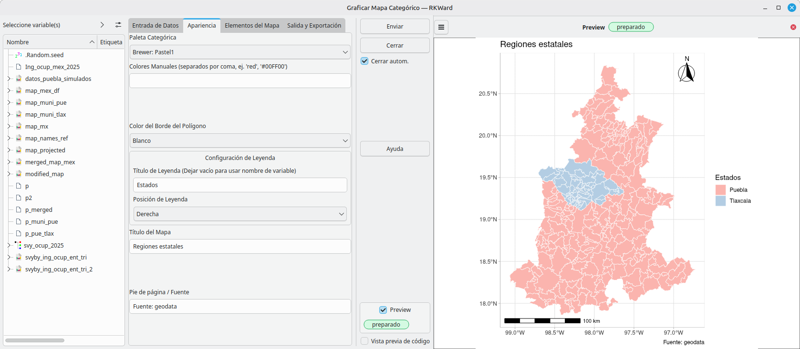

# rk.map.localities: Spatial Data Manager for RKWard


[](https://github.com/AlfCano/rk.map.localities/actions/workflows/lintr.yml)


**rk.map.localities** is a comprehensive spatial data manager for RKWard. While its core feature is connecting to the high-resolution GADM database (via `geodata`) to download **Admin Level 2 boundaries** (Municipalities, Counties), version 0.0.2 expands its capabilities to include importing, exporting, and merging spatial objects.

It is designed to work seamlessly as the "Data Provider" for the **rk.rnaturalearth** plotting ecosystem.

## 🚀 Features

### 1. High-Resolution Downloads (GADM)
*   **Level 2 Precision:** specifically targets the municipality/county level, often missing from standard R map packages.
*   **Intelligent Filtering:** Allows downloading specific States/Regions (e.g., "Puebla", "California") instead of heavy national files.
*   **Smart Caching:** Downloads are stored in a temporary directory to save bandwidth.

    

### 2. Spatial I/O & Management (New in v0.0.2)
*   **Import:** Load external spatial files (`.shp`, `.gpkg`, `.geojson`, `.kml`) directly into RKWard as `sf` objects.
*   **Export:** Save your modified or subsetted maps to standard formats (`.shp`, `.gpkg`, etc.) for use in QGIS or ArcGIS.
*   **Merge Maps:** Combine multiple map objects (e.g., "Puebla" + "Tlaxcala") into a single regional map using `bind_rows`.



### 3. Ecosystem Compatibility
*   **Plug & Play:** The output objects (`sf`) are fully optimized for **rk.rnaturalearth**'s Plotting tools.
*   **Standardized Output:** GADM downloads include standard columns (`NAME_1` for State, `NAME_2` for Municipality) to make data joining consistent.

## ⚠️ Known Issue: Column Name Conflicts

When using maps generated by this plugin with **rk.rnaturalearth** (or any join operation), you must be careful with column names.

**The Problem:**
If your Data Frame contains columns with the **same names** as the Map Object (e.g., `NAME_1`, `TYPE_2`, `ENGTYPE_2`), other than the one used for joining, `dplyr::left_join` will rename them (e.g., `NAME_1.x` and `NAME_1.y`).
*   **Result:** The plotting plugin will fail because it looks for `NAME_1`, but finds `NAME_1.x`.

**The Solution:**
Before plotting, **clean your data frame**. Keep only the Join ID (e.g., the municipality name) and the data values you want to plot. Remove structural columns that duplicate the map's metadata.

```R
# BAD: Data frame has 'NAME_1' (State) which matches the Map
df_bad <- data.frame(NAME_2 = ..., Value = ..., NAME_1 = "Puebla")

# GOOD: Data frame only has the ID and the Value
df_good <- data.frame(NAME_2 = ..., Value = ...)
```

## 📦 Installation

To install this plugin in RKWard, run the following code in your R Console:

```R
# install.packages("devtools")
local({
  require(devtools)
  install_github("AlfCano/rk.map.localities", force = TRUE)
})
```

**System Requirements:**
On Linux (Ubuntu/Debian), ensure system libraries are installed:
`sudo apt-get install libudunits2-dev libgdal-dev libgeos-dev`

## 🌍 Internationalization

The interface is fully localized to match your RKWard language settings:

*   🇺🇸 **English** (Default)
*   🇪🇸 **Spanish** (`es`)
*   🇫🇷 **French** (`fr`)
*   🇩🇪 **German** (`de`)
*   🇧🇷 **Portuguese** (Brazil) (`pt_BR`)

## 💻 Usage

Once installed, find the tools under: **`Plots` -> `Maps`**

1.  **Download Municipalities:** Fetch GADM data.
2.  **Import Spatial Data:** Load external files.
3.  **Export Spatial Data:** Save `sf` objects to disk.
4.  **Merge Maps:** Combine regions.

## 🎓 Quick Start Example

**Scenario:** Visualizing poverty rates in **Puebla, Mexico**.

### Step 1: Download the Map
1.  Open **Download Municipalities**.
2.  **Country:** Mexico (MEX).
3.  **Filter by State:** `Puebla`.
4.  **Save As:** `map_puebla`.

### Step 2: Create Data (Run in Console)
*Note: We strictly define the columns to avoid name conflicts.*

```R
# Check that the map exists
if (exists("map_puebla")) {
  set.seed(123)
  my_data_puebla <- data.frame(
    MuniName = map_puebla$NAME_2,  # Join Key
    PovertyRate = runif(nrow(map_puebla), min = 15, max = 85)
  )
  # We do NOT include 'NAME_1' here to avoid conflicts!
}
```

### Step 3: Plot (Using rk.rnaturalearth)
1.  Open **Plots -> Maps -> Plot Continuous Map**.
2.  **Map Object:** `map_puebla`.
3.  **Map Id Column:** `NAME_2`.
4.  **Data Frame:** `my_data_puebla`.
5.  **Region Name Column:** `MuniName`.
6.  **Value Column:** `PovertyRate`.
7.  **Click Submit.**

    

## 🛠️ Dependencies

*   `geodata` (GADM downloader)
*   `sf` (Spatial object standard)
*   `dplyr` (Data manipulation)

## ✍️ Author & License

*   **Author:** Alfonso Cano (<alfonso.cano@correo.buap.mx>)
*   **Assisted by:** Gemini, a large language model from Google.
*   **License:** GPL (>= 3)
