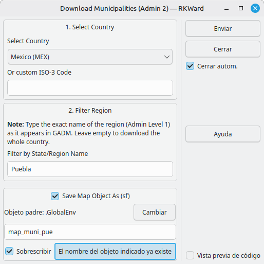
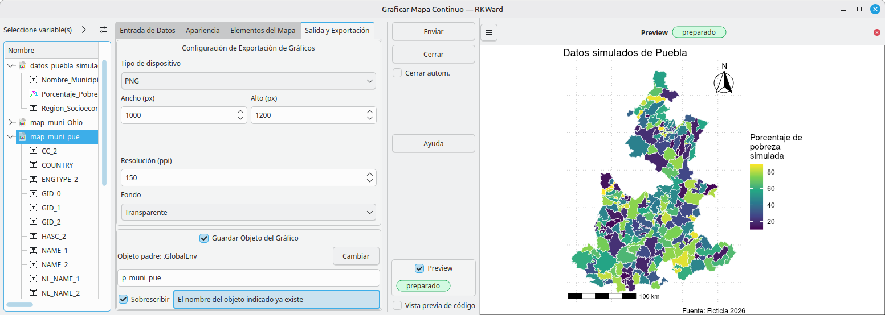

# rk.map.localities: Municipalities & Counties for RKWard


[](https://github.com/AlfCano/rk.map.localities/actions/workflows/lintr.yml)


**rk.map.localities** connects RKWard to the high-resolution GADM database via the `geodata` package. While other plugins (like `rk.rnaturalearth`) focus on national and state-level maps, this plugin specializes in downloading **Admin Level 2 boundaries** (Municipalities, Counties, Districts) for detailed local analysis.

It is designed to work seamlessly as a data provider for the **rk.rnaturalearth** plotting ecosystem.

## 🚀 Features

### 1. High-Resolution Downloads
*   **GADM Integration:** Fetches official administrative boundaries directly from GADM (Global Administrative Areas).
*   **Level 2 Precision:** Specifically targets the municipality/county level, which is often missing from standard R map packages due to file size.
*   **Smart Caching:** Downloads are stored in a temporary directory to avoid re-downloading large files during the same session.

### 2. Intelligent Filtering
*   **State/Region Filter:** Instead of forcing you to download an entire country (which can be heavy and slow), the plugin allows you to specify a **State Name** (e.g., "Puebla", "California", "Bavaria").
*   **Automatic Subsetting:** It downloads the country, extracts only the requested state's municipalities, and returns a clean, lightweight `sf` object ready for plotting.

    

### 3. Ecosystem Compatibility
*   **Plug & Play:** The output objects (`sf`) are fully compatible with **rk.rnaturalearth**'s "Plot Continuous Map" and "Plot Categorical Map" tools.
*   **Standardized Output:** The resulting data frames include standard GADM columns (`NAME_1`, `NAME_2`) to make data joining easier.

## 📦 Installation

To install this plugin in RKWard, run the following code in your R Console:

```R
# install.packages("devtools")
local({
  require(devtools)
  install_github("AlfCano/rk.map.localities", force = TRUE)
})
```

**System Requirements:**
This plugin relies on the `sf` package for spatial handling. On Linux, ensure you have the system libraries installed:
`sudo apt-get install libudunits2-dev libgdal-dev libgeos-dev`

## 🌍 Internationalization

The interface is fully localized to match your RKWard language settings:

*   🇺🇸 **English** (Default)
*   🇪🇸 **Spanish** (`es`)
*   🇫🇷 **French** (`fr`)
*   🇩🇪 **German** (`de`)
*   🇧🇷 **Portuguese** (Brazil) (`pt_BR`)

## 💻 Usage

Once installed, find the tool under:

**`Plots` -> `Maps` -> `Download Municipalities`**

1.  **Select Country:** Choose from the list (Mexico, USA, Brazil, etc.) or type a custom ISO-3 code.
2.  **Filter Region:** Type the exact name of the State/Province (e.g., "Puebla").
    *   *Tip:* Leave empty to download the whole country (Warning: May be slow for large countries).
3.  **Save Object:** Choose a name for your map object (default: `map_muni`).

## 🎓 Quick Start Example

**Scenario:** Visualizing poverty rates in the municipalities of **Puebla, Mexico**.

### Step 1: Download the Map
1.  Open **Download Municipalities**.
2.  **Country:** Mexico (MEX).
3.  **Filter by State:** `Puebla`.
4.  **Save As:** `map_puebla`.
5.  Click **Submit**.
    *   *Result:* You now have a map object `map_puebla` with 217 municipalities.

### Step 2: Create Data (Run in Console)
Since we are just testing, let's simulate some data for these municipalities.

```R
# Check that the map exists
if (exists("map_puebla")) {
  set.seed(123)
  my_data_puebla <- data.frame(
    MuniName = map_puebla$NAME_2,  # NAME_2 contains Municipality names
    PovertyRate = runif(nrow(map_puebla), min = 15, max = 85)
  )
}
```

### Step 3: Plot (Using rk.rnaturalearth)
Now, use the **Plot Continuous Map** plugin from the sister package:

1.  Open **Plots -> Maps -> Plot Continuous Map**.
2.  **Map Object:** `map_puebla`.
3.  **Map Id Column:** `NAME_2`.
4.  **Data Frame:** `my_data_puebla`.
5.  **Region Name Column:** `MuniName`.
6.  **Value Column:** `PovertyRate`.
7.  **Click Submit.**

    

## 🛠️ Dependencies

*   `geodata` (GADM downloader)
*   `sf` (Spatial object standard)
*   `dplyr` (Data manipulation)

## ✍️ Author & License

*   **Author:** Alfonso Cano (<alfonso.cano@correo.buap.mx>)
*   **Assisted by:** Gemini, a large language model from Google.
*   **License:** GPL (>= 3)
